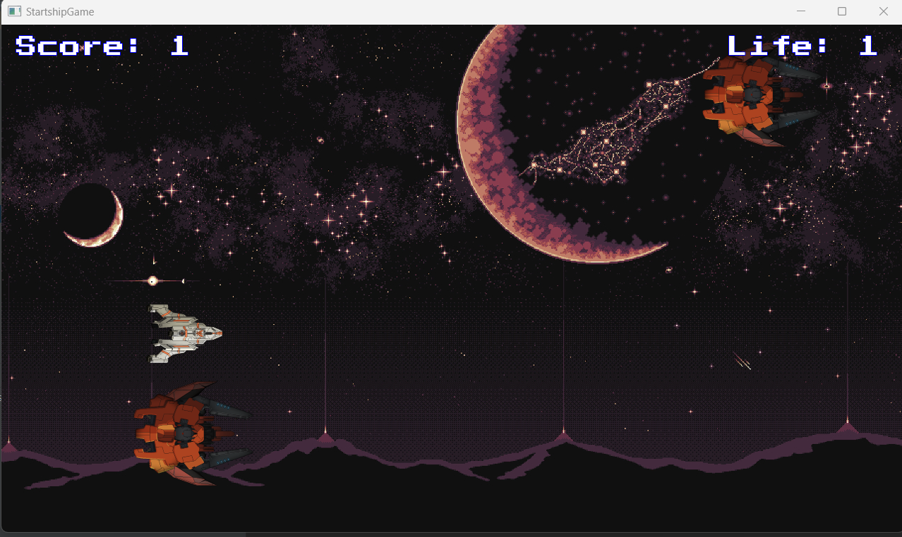

## Startship Game 2D

This is a small project of a 2D game using LibGDX.

Use directional keys <kbd>↑</kbd> <kbd>↓</kbd> <kbd>→</kbd> <kbd>←</kbd> to move the ship and <kbd>SPACE</kbd> to send missiles.

At game over, press <kbd>ENTER</kbd> to restart the game.

### Requirements
- Java JDK 11
- Gradle

### Run

To execute the game you can simple run the command ``./gradlew run``

### Screenshot

#### Thank you

Thanks to Marcos Oliveira from Terminal Root for posting the serie of how to create the game using Java and LibGDX.

[Marco's Oliveira - Original Project Repository](https://github.com/terroo/spaceship)

[Marco's Oliveira - Video Series](https://www.youtube.com/watch?v=2bmvlwvnirk&list=PLUJBQEDDLNclxZvKTT2Icq9aVBPqLRMCA&ab_channel=TerminalRoot)
